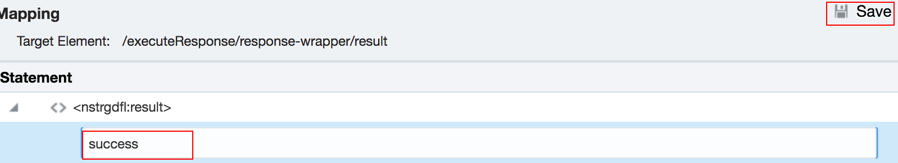

# LabGuide 100 - Creating the ATP Integration on OIC

## Introduction

The Health&Safe department is trying to secure their construction sites by allowing employees to report the security issues. To
be able to provide a convenient and efficient way, they plan to take advantage of VBCS and build a PWA application. Meanwhile,
the admin team can monitor all the incidents and take actions on time.

This is the first of several labs that are part of the **Oracle Visual Builder Cloud Service Workshop.** During this workshop you will explore Oracle's  Application Integration, and Visual Builder Cloud Service and its features from the persona of **Javascript Developer**, Joy. You will follow Joy as he creates an integration, and links your on premise database or Autonomous Database to the PWA application. In our first lab you will create an integration using ATP adapter to be able to store the new created incidents there.

## Objectives

- Explore the Application Integration
  - Configure the connections of ATP
  - Build the integration to insert data on ATP
  - Export/Import the Integrations to your environment

# Using OIC to Connect the Database

##  Create the InsertIncidents Integration

### Step 1
Log into Oracle Cloud and locate **Integration** service, and open the console service

###Step 2
Once you reach the OIC homepage, click the Integration tab

###Step
Open the Connection tab to create the ATP connection

###Step
Click Create on the top right, and search for the ATP connector in the wizard

###Step
Choose ATP, and give it a proper name and some description:

###Step
Fill in the connection and security authentication details

###Step
Test it and save it

###Step
Similarly, create a Rest connection like the above

###Step
Now, let's move to Integration tab

###Step
Click the Create on the top right, and choose the App-Driven architecture

###Step
Give it a proper name and click on create

###Step
An empty canvas will appear and click on the + sign to add the Rest Connection you just created

###Step
Give it a proper name and optional description

###Step
Fill the information like the screenshot, and click Next

###Step
After you click Finish, there is a map created along with the connection

###Step
Click the + sign again to add the ATP connection

###Step
Give it a proper name and optional description

###Step
Choose what you want to do with the database, here we are trying to post Instances to database

###Step
Click on finish and you will see two mappers on the canvas

###Step
Now let's do the mapping. Click on the first mapper

###Step
Map the attributes and click Validate on the top right corner

###Step
Go to the second mapper and click on the Status

###Step
Type in "Success" and click Validate

###Step
Last step is to add the tracking, click the hamburger icon on the top right corner

###Step
Go back to the homepage and click on the Activate button

###Step
Allow Tracking and Payload

Note: Now your first integration is finished and you can test it on Postman
