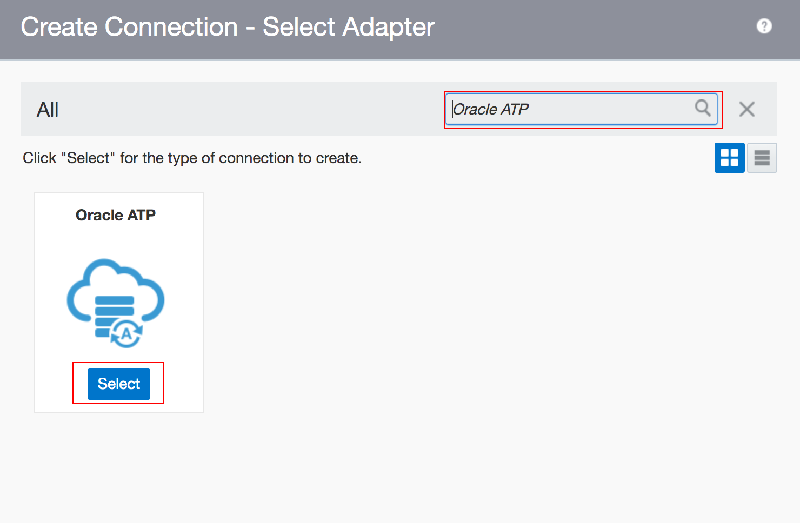
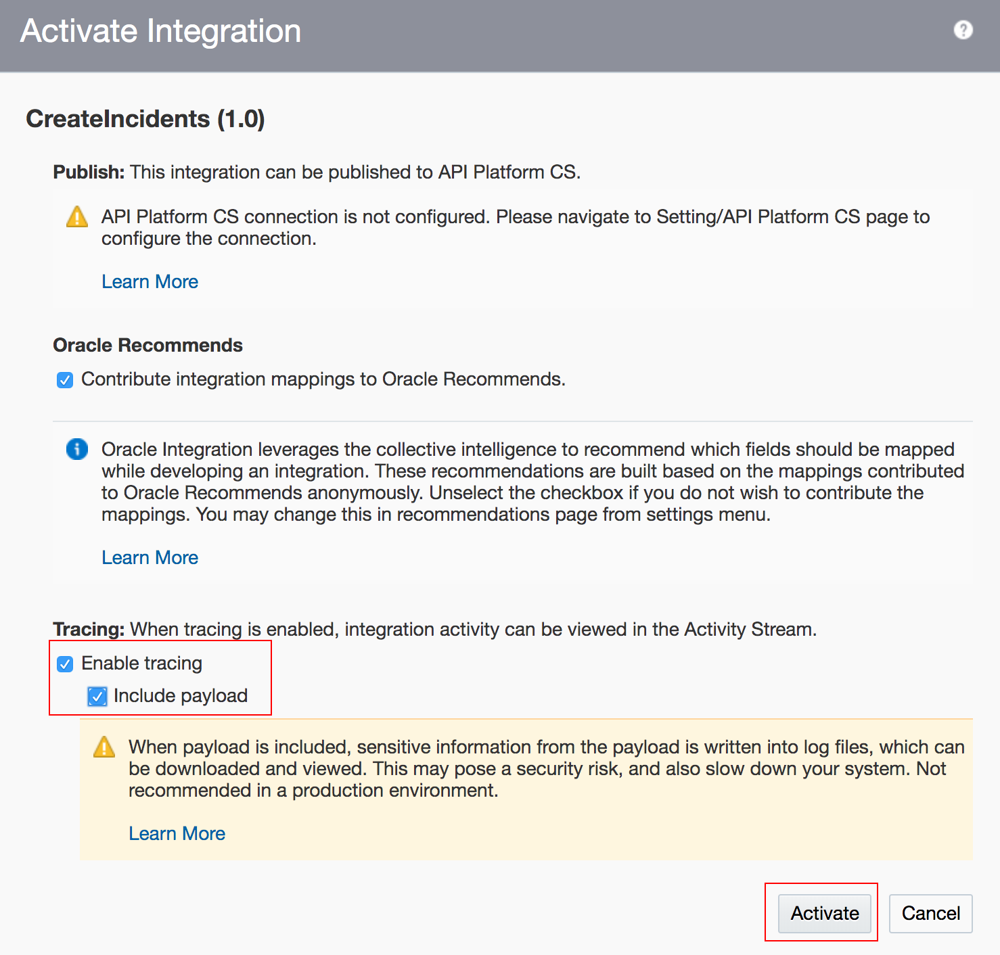

# LabGuide 100 - Creating the ATP Integration on OIC

## Introduction

The Health&Safe department is trying to secure their construction sites by allowing employees to report the security issues. To
be able to provide a convenient and efficient way, they plan to take advantage of VBCS and build a PWA application. Meanwhile,
the admin team can monitor all the incidents and take actions on time.

This is the first of several labs that are part of the **Oracle Visual Builder Cloud Service Workshop.** During this workshop you will explore Oracle's  Application Integration, and Visual Builder Cloud Service and its features from the persona of **Javascript Developer**, Joy. You will follow Joy as he creates an integration, and links your on premise database or Autonomous Database to the PWA application. In our first lab you will create an integration using ATP adapter to be able to store the new created incidents there.

## Objectives

- Explore the Application Integration
  - Configure the connections of ATP
  - Build the integration to insert data on ATP
  - Export/Import the Integrations to your environment

# Using OIC to Connect the Database

##  Create the InsertIncidents Integration

### Step 1 Launch the OIC homepage, click the Integration tab

### Step 2  Open the **Connection** and click **Create**

### Step 3 Search the ATP and select it

### Step 4 Give it a proper name and some description:

### Step 5 Fill in the connection and security authentication details

### Step 6 Test it and save it

### Step 7 Similarly, create a Rest connection like the above

### Step 8 Give the rest connection a name without the connection and security authentication details

### Step 9 Now, let's move to Integration tab, and click the Create on the top right

### Step 10 Choose the App-Driven architecture

### Step 11 Give it a proper name and click on create

### Step 12 An empty canvas will appear and click on the + sign to add the Rest Connection you just created

### Step 13 Give it a proper name, fill the information like the screenshot, and click Next

### Step 15 After you click Finish, there is a map created along with the connection

### Step 16 Click the + sign again to add the ATP connection

### Step 17 Give it a proper name. Choose what you want to do with the database, here we are trying to insert instances to database

### Step 18  Click Next, choose **Admin** as Schema and hit search. Locate **Incidents** table and Import tables

### Step 19 Select all the attributes except **status comments incidentID**

### Step 20 Click Next and click **Edit**

### Step 21 Click on finish and you will see two mappers on the canvas

### Step 22 Now let's do the mapping. Click on the first mapper

### Step 23 Map the attributes and click Validate on the top right corner

### Step 24 Go to the second mapper

### Step 25 Click on the Status

### Step 26 Type in "Success" and click Save

### Step 27 Last step is to add the tracking, click the hamburger icon on the top right corner

### Step 28 Go back to the homepage and click on the Activate button

### Step 29 Allow Tracking and Payload

Note: Now your first integration is finished and you can test it on Postman
