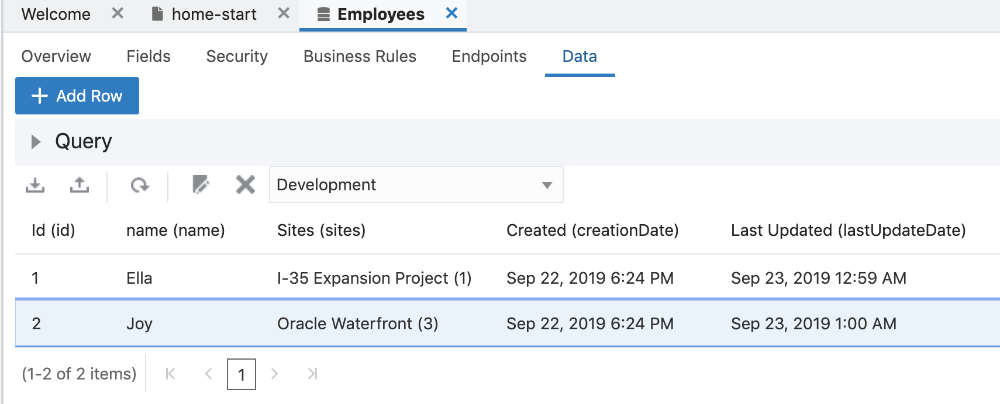

# Lab 200 - Creating a Visual Builder Application

## Introduction

This is the second of several labs that are part of the **Oracle Visual Builder Cloud Service workshop.** This lab will walk you through creating a mobile application so that site workers can log incidents and search FAQ's. We will also learn how to create and use Business Objects, modify page user interface.

## Objectives

- Begin Creating a Mobile Application
  - Create application within Visual Builder user interface
  - Add business data for application to display
- Create the Application Pages
  - Create pages for displaying business data
  - Modify User Interface of the Home Page

# Create an Application and Import Business Data

##  Create the Application

### **STEP 1**: Access Visual Builder Cloud Service

- Click on the **Hamburger** icon at the top of the page and click on **Home** icon to **Open OIC Homepage**.

  

- Click on **Visual Builder** to **Open Visual Builder Cloud Service HomePage**.

  

- Click **New Application** button to start the application create wizard.

  

- On Details screen enter the following data and click on **Next**.

  In the Create Application dialog box, enter the following, then press **Create**.

  - **Application Name:** ```HealthSafetyApp```
  - **Description:** ```VBCS Workshop```
  - **Application ID:** The text field is automatically populated as you type based on the Application Name.

    

  **NOTE:** _If you receive a browser warning please update/change your browser to a compatible version._

    

- You now have a new application, in which you can begin building pages and adding data.

  

## Import Business Data

### **STEP 1**: Importing Business Data

In this step we will create a new business object to host data for our application.

- Open the **Business Objects** by clicking on the "Business Objects" button.

  

- Click the "menu" icon and select "Data Manager" from the dropdown to open the import tool.

  

- Now we'll import the App data from a file. In the right hand pane select the **Import Business Objects** window.

  

- Download this spreadsheet <a href="https://github.com/CSH-Integration/VBCS-Workshop/blob/master/avbcsMisc/SafetyApp.xlsx" target="new">SafetyApp.xlsx</a> to your local machine. When prompted upload this file to create a new business object.

  

- You will see a popup stating that the upload is taking place and it will confirm that the upload finished with a message stating "Upload succeeded."

  

- Click **Next**

  

- The business objects will be displayed with the option to edit the names, we will be leaving the names as they are and click **Next**.

      

- The next step will display the fields that will be created and will detect the data types and set them accordingly. You can edit the names and types here but we will be leaving them as they are imported. Click **Finish**.

  

- Once the import is finished, you will receive a message showing the business objects that have been imported. Click the **Close** button.

  

- You should now see the **Employees** **FAQ** and **Sites** business objects in the panel on the left. Click on the **Employees** Business Object. If the objects do not immediately appear refresh your browser.

  

- You will see the details of the business object in the right hand panel.

  

- Now lets see how we can define parent/child relationship between Business Objects. For our example we have **Sites** which is our parent and **Employee**, since many employees work on a site.

- Click on the **+** button under Relationship a pop-up will come up as shown below.

  

- From right box select **Sites** and click **Create Relationship** 

  

- Now Click on **Data** tab under **Employees** Business Object and you can see there new field is ```Sites(sities)``` this is foreign key of **Sites**.

  

- Now lets assign the site to our employees by editting first record. **Select** first record and click **edit icon** as shown below.

  

- A Dialog box appears click on **Sites** drop-down and select first option and click save.

  

- Similarly assign site to second employee too.

  


### **STEP 2:** Creating the Mobile App

Now that we have data for our app to display we can build our mobile app.

- Click on the **mobile** icon in the left panel to open the mobile apps panel. Then click on the **+ Mobile Application** button to create a new web app.

  

- You will be presented with the New Mobile Application window. In this window, name the mobile application ```HealthSafetyMobileApp``` and choose the  Horizontal navigation style, in Navigation Items delete one item by clicking on **X** enter ```Home``` and ```My Incidents``` then click **Finish**.

  

- You will see the new app created with the name **home-start**. To keep the page clean close all your web application pages.

  

### **STEP 3**: Add Mobile App Pages

- At this point you should be seeing a view of your mobile application in the development console. We'll now begin by add components on our homepage.

  

- The main page for our application is created for us automatically, so we will begin by adding components to our homepage data. Let us assume UX team provided with the homepage design like as shown below.

  

- First let us rename the page title by clicking on page title and entering ```Safety Actions``` on right navigation as shown below. 

  

- Next from the component list, drag and drop **Grid Container** over to the Page Structure right on top of **Flex Container**

  

- Similary from the component list, drag and drop **Button** over to the Page Structure right on top of **Grid Container**. In right side menu under General tab enter text as ```Incident``` and select **Full** option for chroming.
  
  

- Now, to put a start icon on the button, click **+** near **startIcon** under Slots and select **icon** from menu.

  

- Click on **icon** under **startIcon** as shown below

  

- Click on the button next to **Image** and select **Warning Sheet** icon.

  

  

- Since we have two buttons in one grid we will drop another button under the same Grid Container and name it as ```Hazard``` Select chroming **Full** and start icon **Warning** similarly as done for above button. 

  

- Repeat the last 5 steps to add another **Grid Container** on top of **Flex Container** and add two more buttons with following details.

- **Text/Name**: FAQ,Inspection
- **Chroming**: Full
- **Start Icon**: Catalog, Checkmark

  

- Now as you can see all our buttons are not aligned as per the design, to align it click on **Flex Container** and Select Direction as **Horizontal**.

  

- Still our UI seems a bit off from our design, in new step we will see how we can style our home


### **STEP 4**: Styling HomePage (CSS)

- Note: All styling in VBCS applications happens manually in CSS. There are no declarative features for changing the display of text or images. As all VBCS applications are just JET applications, they use JET Themes to style the applications. Read the <a href="https://docs.oracle.com/en/middleware/jet/4.2.0/develop/theming-applications.html" target="new">JET Dev Guide on Themes</a> for more information. By default, all VBCS applications use the Alta UI Theme. VBCS applications have a built-in app.css file that you can use to define additional styling on top of the main Alta theme. If, you want to style the core elements of a VBCS theme, you should use SASS variables and generate the CSS rather than coding against the DOM elements directly using oj-* selectors in app.css. The reason is that the internal DOM of JET elements can and does change between releases of JET. Therefore a CSS that worked in one release may not work in another. SASS variables insulate you from these changes.

- From Left Navigator open **app.css** by expanding **resources > css**

  

- Copy paste the below code in app.css
```css
.dash-btn {
    height:200px;
    width:100%;
}

.dash-grid-container {
  margin-top: 70px;
  padding: 0 5px  10px;
}
```

- Now let us add those css class to our components, first we will add the css to our **Grid Container**. Click first **Grid Container** from Page structure  then from left navigation select **All** tab and expand **General Attributes** and add css class ```dash-grid-container```. Note make sure there is a space between existing class and newly add class.

  

- Next let us add css to out button component to make it look bigger as per design. To do so Click first **Button** from Page structure  then from left navigation select **All** tab and expand **General Attributes** and add css class ```dash-btn```.

  


- The other way of apply css class is by switching to code view. Lets apply the css class to other grid container and all remaining buttons by switching to code view. Click on the **Code** button on upper right corner.

  

- Add the css class ```dash-grid-container``` to the remaining **Grid Container** and ```class="dash-btn"``` to all remaining buttons

  

- At this point your home page should look like as shown below.

  


# Summary

  We have now created a mobile application in Visual Builder Cloud Service, added our business object. The next lab in the series will guide us through add new pages to create incidents and send data to Oracle ATP Database leveraging the Integration we created in lab 100.

- You may proceed to [Lab 300](LabGuide300.md)
