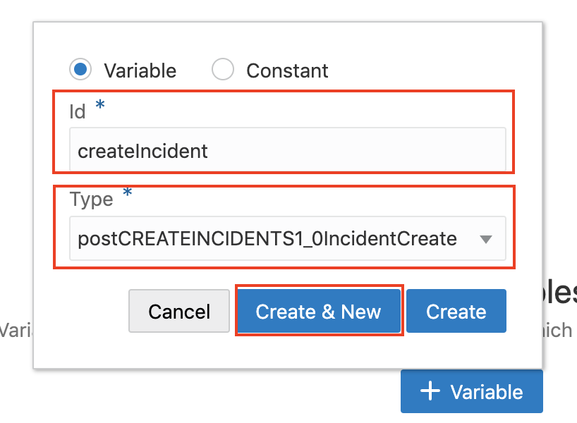
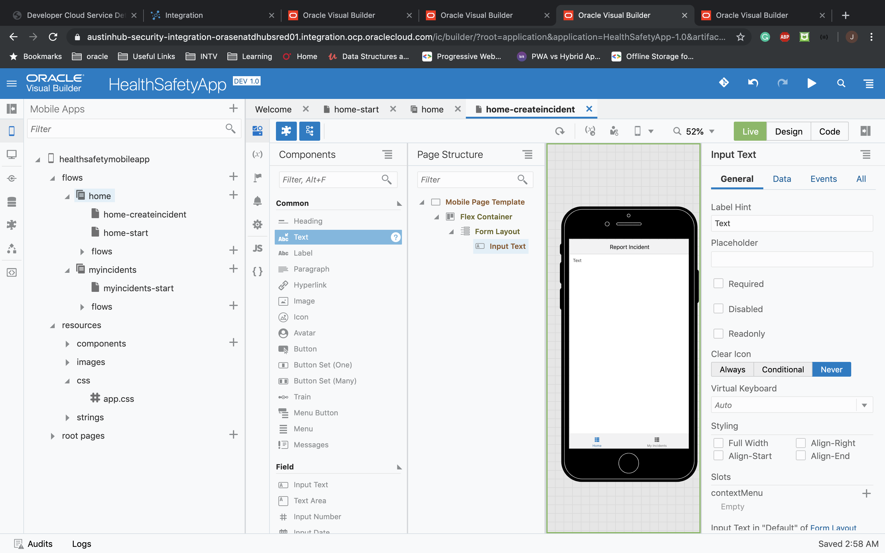
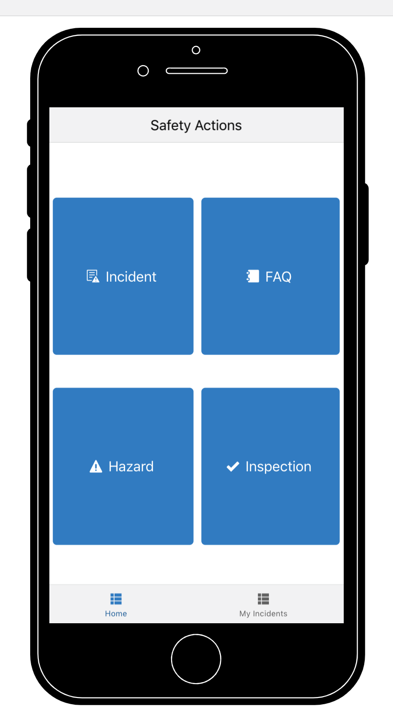

# Lab 300 - Incorporating OIC Integration into VBCS Application

## Introduction

This lab will walk you through creating an incident page for logging incidents and also incorporating OIC Integration into the mobile application.

## Objectives

- Create a mobile page to record Incident
- Add a OIC service connection to the application
- Post data to OIC from the Mobile application

## Required Artifacts

- This lab assumes that you have completed [Lab 100](LabGuide100.md), [Lab 200](LabGuide200.md).

# Create Mobile Pages to record Incident

## Making Mobile Application Modifications

### **STEP 1**: Add OIC Service Connection

We will now add the Service Connection that we will use to retrive and post data to database via OIC.

- In your application development console, click on **Service Connections** icon in the far left panel.

  

- Add a service connection by press the **"+ Service Connection"** button.

  

- In the **Create Service Connection** window, we will choose **Select from Catalog** as our source.

  

- Select **Integration** as the Service Type

  

- In Create Service dialog box select the **CREATEINCIDENTS** and **GETINCIDENTS** under Default
Package and click **Create**. This will import the integration metadata into VBCS.

  

- Select **Endpoints** tab and you can see all the integration imported to vbcs.

  

- Open **GETINCIDENTS** by clicking on **GET**. you can see all the details regarding the OIC integration endpoint.

  

- Click on **Test** tab and click **send** to get the incidents.

  


- Now that the connection is configured we'll create UI to record incidents. To do so we'll set up a variable on the page to store the request from user input and then send the request to OIC via the service connection we created in step 1.

### **STEP 1**: Add a Create Incident Mobile Page

Now we'll add a page to Create Incident and once that is complete we'll define variable to store user input before sending to OIC ```CREATEINCIDENTS```

- Create new page by expanding the **healthsafetymobileapp --> flows --> home** and click the **+** icon near **home**.

  

- In **Create Page** pop-up window enter **Page Id** as ```home-createincident``` select **Custom** as page template and then click **Create**

  

- Open right navigation pane and change **Page Title** to ```Report Incident```

  

- Before We create out form layout for submitting request to create incident, let us create an object type and variable that will store the user inpit.

- Open **Variable $ Types** tab by Clicking on **(x)** icon

  

- Click on **Types** tab then click **+ Types** button and select **From Endpoint**

  

- Expand **Service Connections --> ics --> CREATEINCIDENTS** Select **POST** operation and click **Next**

  

- From endpoint structure expand **Request** and select all **expect IncidentNo** and click **Finish** 

  

- Now Click on **Variables** tab and click **+ Variable** button to create variable to store user input

  

- Enter **id** as ```createIncident``` and select **Type** as ```postCREATEINCIDENTS1_0IncidentCreate``` and click **Create & New**

  

- Create another variable and enter **id** as ```capturedImage``` and select **Type** as ```String``` and click **Create & New**

  

- Create last variable and enter **id** as ```empName``` and select **Type** as ```String``` and click **Create**

  

- Now we have defined our variables let us create the form to take user input. Go back to **Designer** page by clicking the icon show below.

  

- Now, Drag and Drop **Form Layout** from Components on top of **Flex Container** in page structure.

  

- Now Drag and Drop **Input Text** from Components on top of **Form Layout** in page structure.

  

- In left Navigation Panel under **General** tab Enter **Label Hint** as ```Employee ID```

- Now open **Data** tab and click **down arrow** next to **fx** and select ```EmployeeID``` under **createIncident** object

  

- Similarly Drag and drop another **Input Text** from Components on top of **Form Layout** in page structure.

  

- In left Navigation Panel under **General** tab Enter **Label Hint** as ```Name```

- Now open **Data** tab and click **down arrow** next to **fx** and select ```empName``` 

  

- Now Drag and Drop **Select (one)** from Components on top of **Form Layout** in page structure.

  

- In left Navigation Panel click **Add Options** to populate drop-down data

  

- In Add Options pop-up Choose the source of your data as **Sites** under Business Object and click **Next**

  

- From endpoint structure under response drag and drop **siteName** in Label and **id** under value and then click **Next**

  

- Click **Finish** to close dialog box.

- Click on **General** tab and change Label hint to ```Site``` and Placeholder to ```Select Site```

  

- Now open **Data** tab and click **down arrow** next to **fx** and select ```SiteID``` under **createIncident** object

  

- Now Drag and Drop **Radio Button Set** from Components on top of **Form Layout** in page structure.

  

- In left Navigation Panel click **Create Static List of Options** to create options for radio button

- In pop up enter following options
Label : Value
High : high
Medium : med
Low : low

- Click **Finish** to close the pop-up

  

- Click on **General** tab and change Label hint to ```Severity```

  

- Now open **Data** tab and click **down arrow** next to **fx** and select ```Severity``` under **createIncident** object

  

- - Now Drag and Drop **Text Area** from Components on top of **Form Layout** in page structure.

  

-  In left Navigation Panel change Label hint to ```Description```

- Now open **Data** tab and click **down arrow** next to **fx** and select ```Description``` under **createIncident** object

  

- Drag and Drop **Image** from Components on top of **Form Layout** in page structure.

  

- Now open **Data** tab and click **down arrow** next to **fx** and select ```capturedImage``` 

  

- Drag and Drop **Button** from Components on top of **Form Layout** in page structure. Empty **Label Text** , **Text** as ```Take Picture``` and chroming **Full**

  

- Drag and Drop another **Button** from Components on top of **Form Layout** in page structure. Empty **Label Text** , **Text** as ```Submit``` and chroming **Full**

  


### **STEP 2**: Define action chains

In this steps we will define action chains to take picture from camera and submit the data to call OIC service for posting data into database. Also we will see how to write custom client-side javascript to display the image in UI and convert blob to base64String so that database can store it. 

- Click on **JS** button on the navigation pane and copy paste the below javascript functions, after ```var PageModule = function PageModule() {};``` and before ```return PageModule;```

```javascript
      //This function loads/displays the picture in image field (UI)
  PageModule.prototype.showPic = function(fileBlob) {
    const blobURL = URL.createObjectURL(fileBlob);
    // Release the BLOB after it loads.
    document.getElementById("img-1689111029-1").onload = function() {
      URL.revokeObjectURL(blobURL);
    };
    return blobURL;
  };
  
    // This function will convert blob to base64String
  PageModule.prototype.convertToBase64String = function(fileBlob) {
    return new Promise((resolve, reject) => {
      var base64String;
      var reader = new FileReader();
      reader.readAsDataURL(fileBlob);
      reader.onloadend = () => {
        let base64dataURL = reader.result;
        base64String = base64dataURL.split(',')[1];
        //console.log(base64String);
        resolve(base64String);
      };
    });

  };
```
  


- Go back to designer page from navigation pane

- Select **Take Picture** button and click **Events** tab

  

- Click **+ New Event** and Select **Quick Start** action

  

- This will open up the action chain flow. Enter action chain id as ```TakePicture```

  

- From General Actions Drag and drop **Take Photo** action on the action chain.

  

- Next Drag and drop **Call Module Function** after **Take Photo** and click **Select Module function** button on right panel

  

- From pop-up Select Page function as **showPic** and click **Select** Note:These are the same javascript function we wrote

  

- From right panel click **Assign** button to map input Parameter to our function

  

- In the pop-up from sources expand **takePhoto1** and drag the **file** variable to **fileBllob** on Target, then click **Save**

  

- Select Return Type as **String**

- Again Drag and drop **Call Module Function** after **callModuleFunction show pic** and click **Select Module function** button on right panel

  

- From pop-up Select Page function as **convertToBase64String** and click **Select**

  

- From right panel click **Assign** button to map input Parameter to the function

  

- In the pop-up from sources expand **takePhoto1** and drag the **file** variable to **fileBllob** on Target, then click **Save**

  

- Select Return Type as **String**

- Now From General Actions Drag and drop **Assign Variable** action on the action chain after **callModuleFunction convertToBase64String** then click **Assign** to assign value to variables.

  

- Map the **callModuleFunction1** from Source to **capturedImage** on Target, similarly mao **callModuleFunction2** from source to **Image** (under createIncident Object). Click **Save** to close the pop-up

- Now again Go back to designer page from navigation pane

- Select **Submit** button from page structure and click **Events** tab

  

- Click **+ New Event** and Select **Quick Start** action

  

- This will open up the action chain flow. Enter action chain id as ```SubmitData```

  

- From General Actions Drag and drop **Call REST Endpoint** action on the action chain and click on **Select Endpoint** button from right panel.

  

- To Select OIC endpoint From the pop-up expand **Service Connections --> ics --> CreateIncidents --> POST** then click **Select**

  

- Click **Assign** button next to paramater

  

- In the pop-up drag and drop **createIncident** object from source to **body** parameter on target. Click **Save** to close the pop-up

  

- Now from General Actions drag and drop **Fire Notification** on **success** path and in right panel enter **Summary** as ```Incident Created Successfully``` and **Notification Type** as **confirmation**

  

- Similarly from General Actions drag and drop **Fire Notification** on **failure** path and in right panel enter **Summary** as ```Incident creation Failed``` and **Notification Type** as **error**

  

- Now before testing our app lets go back to **home-start** page and select **Incident** button and select **Events** tab from right panel

  

- Click **+ New Event** and Select **Quick Start** action

  

- This will open up the action chain flow. Enter action chain id as ```navToCreateIncident```

  

- From Navigation Actions Drag and drop **Navigate** action on the action chain and click on **Select Target** button from right panel.

  

- From the pop-up select **Peer Page**

  

- Now Select **home-createincident** and click **Select button**.

  


- Let's test our app until this point click on **Play** button on top right side. This will launch the app in new tab.

  

- You should be able to see your app in emulator as shown below.

  

- Now Click on **Incident** Enter the **details**, **upload picture** and hit **Submit** 

- If you get the error check browser console as shown below

  

- **This completes Lab 300 and the Workshop**
