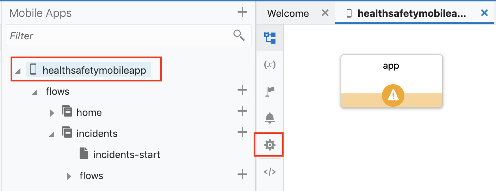

# Lab 400 - Retrive Incidents form Database via OIC and display into mobile app

## Introduction

This lab will walk you through creating a mobile application page for viewing all incidents by incorporating REST service exposed via OIC into the mobile application.

## Objectives

- Create a mobile page for viewing incidents
- Incorporate data retrieved from OIC service connection (We have already imported the service in Lab 300) into application
- Complete a small activity to add FAQ page and populate the page with data from Business Object.

## Required Artifacts

- This lab assumes that you have completed [Lab 100](LabGuide100.md), [Lab 200](LabGuide200.md), [Lab 300](LabGuide300.md).

# Edit Mobile Pages for Incidents

## Making Mobile Application Modifications

### **STEP 1**: Edit Incident tab

Now we'll edit incident page to display all incidents and once that is complete we'll incorporate data retrieved from a OIC REST endpoint into our page.

- Open the incidents-start page by expanding the **healthsafetymobileapp --> flows --> incidents** menu and click the **incidents-start**.

  

- Navigate and open the **Page Structure** panel. This will make it easy to see all the components and select the List View component which we will work with next.

  

- First let us rename the page title by clicking on page title and entering ```Incidents``` on right navigation as shown below. 

  

- Drag and drop the **List View** component from the **Component** panel to **Page Structure** under **Flex Container**.

  

- With the List View component selected, from **Quick Start** tab in the right panel and select **Add Data**.

  

- From the pop-up Select the **GETINCIDENT** Service connection under **ics** and click **Next**.

  

- This will bring us to **Select List Item Template** select 2 template and click **Next**.

  

- Now in **Add Data** page select or drag and drop the fields we need to show in out list and select primary key as **IncidentNo**. click **Next**.

  Note: 1. You can rearrange the data under **Item Template Fields** to display as you want.
        2. The primary key is used to refer to single list item record.

  

- Click **Finish** to close the window.

- You should be able to see all the incidents from the database retrived via OIC service connection.

  

- Also as you can see the screen shot below it gives options to add **Create, Edit, Details, Delete Page** if you have endpoints for each of this action then it can be easily added to the app.


### **STEP 2**: Run the app as PWA

We will now see how we can enable PWA to to build our app run and deploy it on VBCS.

- Click on you app name (**healthsafetymobileapp**) from left panel then,In center navigation pane, click on the **Settings** icon as shown below.

  

- Click on **PWA** tab and **Enable Progressive Web App (PWA)** open Advanced file caching to see all the files that would be cache when app is run as PWA. Also you change the theme color and background color of your app.

  

- Now run the app by clicking on **Play Icon** on upper right corner.

  

- If you ready to test app on your device click on **Build my App** button from right panel.

  

- To stage the application from the pop-up. Choose **Populate Stage with Development data** then click **Stage** 

  

- Wait for few second and you will see a QR code for openning the app on your device. Scan the QR code login with your cloud credentials 

  

- Now in order to have the app on your mobile screen as native app. After you scan the QR code it will prompt to open the url click **open**

  

  Iphone user: Click on **Bookmark** from safari browser and click **Add to Home Screen**

  

### **STEP 3**: Activity

- Add new FAQ page under **home** and add list view and populate it with FAQ business object data (Questions). Add a details page see the answer for the FAQ. Run, Build the app and re-launch the app on your device the new changes are automatically incorporated.

- **This completes Lab 400 and the Workshop**
